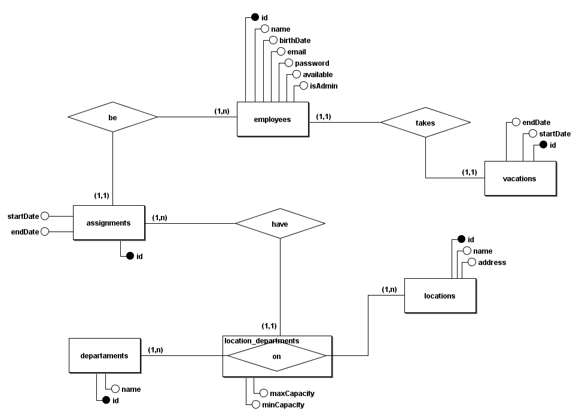
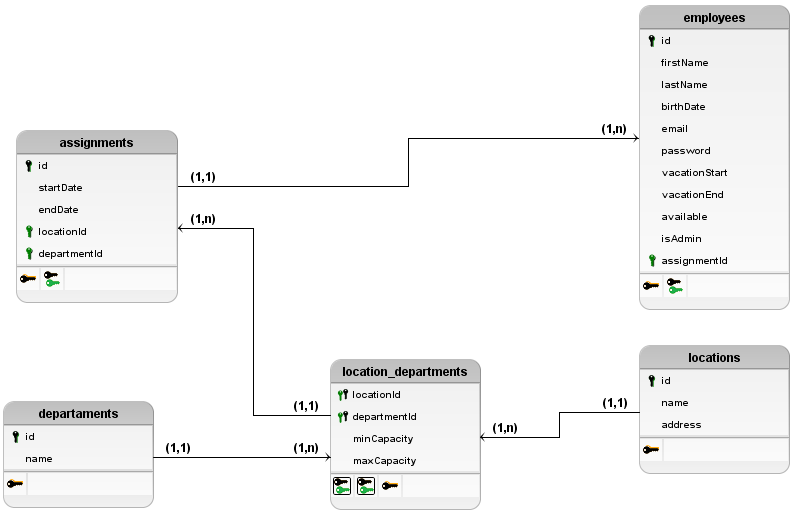

# Employee Management System

## Sistema de Gerenciamento de Funcionários

## Sobre o projeto

Sistema que gerencia as atribuições e alocações dos funcionários de uma determinada empresa com controle de acesso e mais.

### Tecnologias

- NodeJS
- Express 
- MySQL 
- JSON Web Token

### Modelo Conceitual



### Modelo Lógico 



## Como executar o projeto

**Requisitos:** Servidor MySQL como Wampserver ou XAMPP e NodeJS.

1. Na pasta raiz, navegue até a pasta `backend` e execute no terminal o comando: 
	```powershell
	npm install
	```

2. Localize o arquivo `.env.example`, renomeei ele para `.env` e preencha as variáveis nele, sendo: 
	- port: A porta em que a API irá ser inicializada.
	- mysql_host: O host do seu servidor MySQL.
	- mysql_user: O seu usuário do servidor MySQL.
	- mysql_pass: A senha do seu sercidor MySQL.
	- mysql_db: O nome do banco de dados do projeto. Pode ser qualquer um que já não exista.
	- admin_email: O e-mail do usuário administrador.
	- admin_pass: A senha do usuário administrador.
	- jwt_pass: A senha de criptografia do JWT.

3. Ainda na pasta backend, execute o seguinte comando: 
	```powershell
	npm start
	```

4. Após isso, acesse o link que aparecerá no terminal, ou no navegador de sua preferência acesse: `http://localhost:{a porta da sua api}/api-docs`

## Funcionamento

Apenas duas rotas são acessíveis sem precisar de autenticação, que são a de login e a de cadastro de funcionário e apenas duas outras rotas são acessíveis a usuários não administradores, são elas `/profile` e `show-assignments`, que mostram o perfil do funcionário e o outro as suas atribuições, respectivamente.

Como ideia geral, o sistema serve para gerenciar os funcionários, os locais, os departamentos e as atribuições. 

A alocação de funcionários é feita pelo funcionário administrador, ele pode definir onde outros funcionários estarão alocados, por quanto tempo ficarão alocados, seu período de férias e sua disponibilidade atual.

## Pendências

- Uso de containers Docker na aplicação, tanto da parte do Node como do Banco
- Uso de Docker Compose1
- Funções de verificação para mudar status dos funcionários automaticamente de acordo com sua disponibilidade e alocação.

> Miguel Laurentino